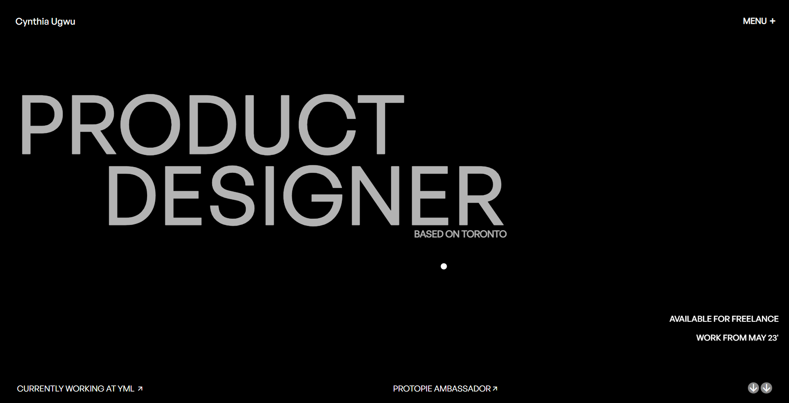

---

# Cynthia Ugwu clone Portfolio



This is a README file for the Cynthia Ugwu Portfolio project, a website showcasing the work of product designer Cynthia Ugwu, based in Toronto.

## Table of Contents

- [Description](#description)
- [Technologies Used](#technologies-used)
- [Preview](#preview)
- [Installation](#installation)
- [Usage](#usage)
- [JavaScript (Under Development)](#javascript-under-development)
- [Contributing](#contributing)
- [License](#license)

## Description

This project is a portfolio website designed to showcase the work and achievements of Cynthia Ugwu, a talented product designer. The website features a sleek and modern aesthetic with interactive elements.

## Technologies Used

- HTML5
- CSS3
- JavaScript (Under Development)
- [Font Awesome](https://fontawesome.com/)
- [Remixicon](https://remixicon.com/)

## Preview

You can view the live demo of this project by visiting [Cynthia Ugwu Portfolio Demo](https://hirendhola.github.io/clone-cynthiaugwu/)

## Installation

To run this project locally, follow these steps:

1. Clone the repository to your local machine:

   ```bash
   git clone https://github.com/yourusername/yourproject.git
   cd yourproject
   ```

2. Open the `index.html` file in your web browser to view the portfolio website.

## Usage

The portfolio website consists of several sections:

- **Home Page (`index.html`):** The landing page with a stylish circle element and a navigation menu. The main hero section introduces Cynthia Ugwu and her availability for freelance work.

- **Projects Section (`#second`):** This section showcases Cynthia's featured projects, including "the plug," "IXPERIENCE," and "HUDU." Each project is presented with its name and the year it was created.

- **About Section (`#about`):** This section provides information about Cynthia and her design philosophy. It includes an image of Cynthia, a brief description, and a "Let's Talk" link for contacting her.

- **Footer (`lastFooter`):** The footer includes links to Cynthia's social media profiles and displays the current year and time.

## JavaScript (Under Development)

**Note:** The JavaScript functionality for this project is currently under development. We are working to enhance the interactivity and animations of the website. Stay tuned for updates!

## Contributing

If you'd like to contribute to this project or help with the JavaScript development, please follow these steps:

1. Fork the repository.

2. Create a new branch for your feature or bug fix.

3. Make your changes and test them thoroughly.

4. Submit a pull request with a clear description of your changes.

## License

This project is licensed under the MIT License. See the [LICENSE](LICENSE) file for details.

---
